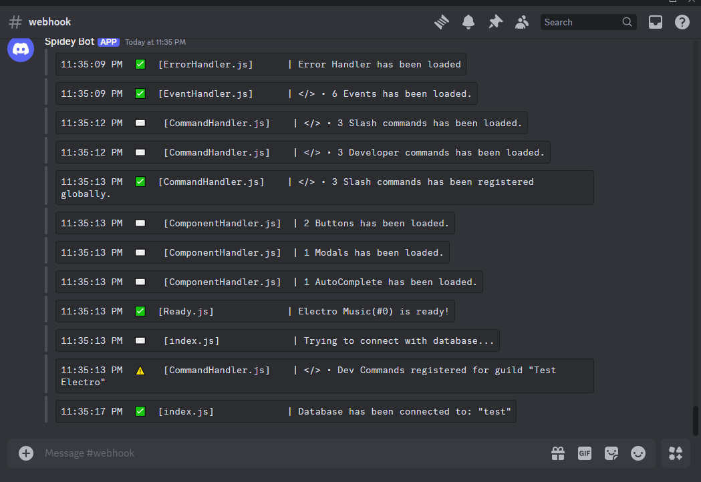
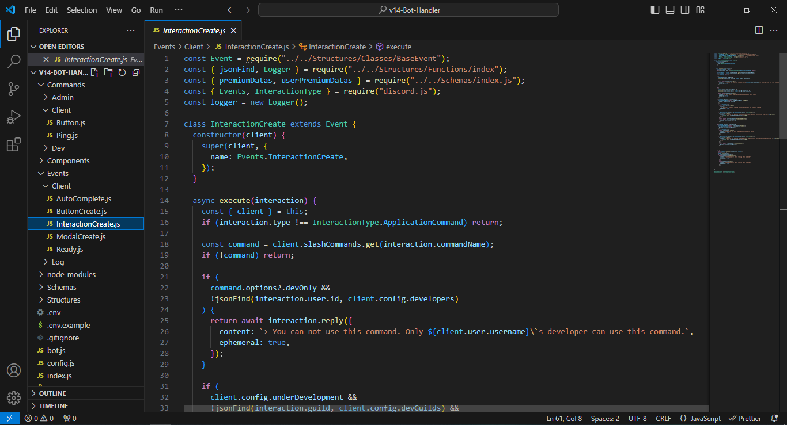
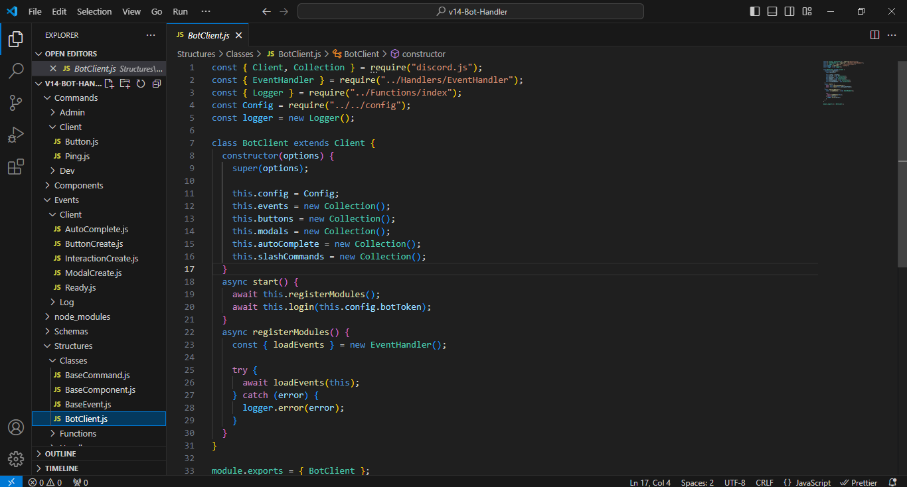

<center></center>

<!-- PROJECT LOGO -->
<br />
<p align="center">
  <p align="center">Advanced bot handler made with discord.js v14.
    <br />
    <br />
    <a href="https://github.com/jasonmidul/v14-Bot-Handler/issues">Report Bug & Request Feature</a>
  </p>
</p>

## Features

- Developed using Discord.js v14
- Multi-language feture with database
- Coustom client
- Event handler
- Button handler
- Modal handler
- Autocomplete handler
- Advanced slash command handler
- Events and commands reload command
- hybrid-sharding
- Dev guild only command
- Guild premium system
- User premium system
- Eval slash command

## ⭐Motivate me with a star if you like this repo⭐

```bash
npm run start
```

## Preview

<h3>Console Logs<br />
    <br />
    <h3>Log Channel<br />
    <br />
    <h3>Slash Command Struucture<br />
    <br />
    <h3>Event Struucture<br />
    <br />
    <h3>Coustom Client<br />
    

### **Need Help with setup?** Join our [Discord Server](https://discord.gg/PZQT6c7gJn) and ask in the `#support` channel
